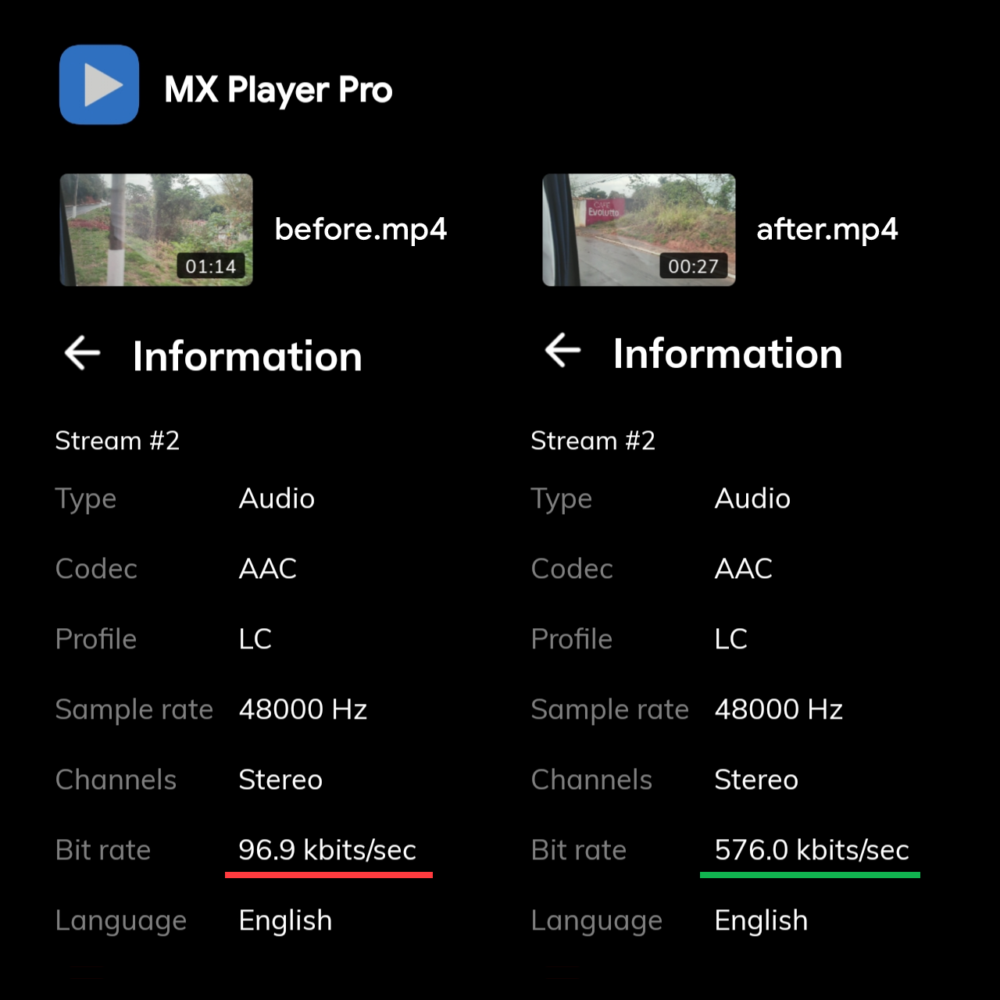
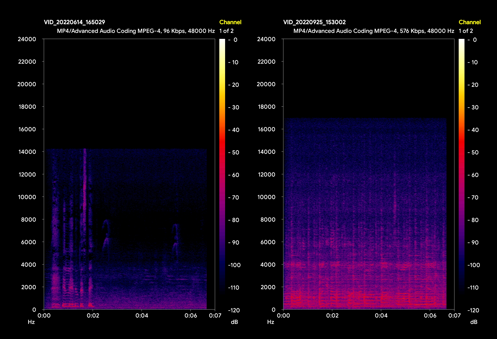

# Pro Rec ingres

## Magisk module
Improves the audio quality in video recording for ingres devices like POCO F4 GT and Redmi K50 Gaming on MIUI 13. Record videos with maximum audio quality from the stock camera and other apps, in ACC up to 288k mono, 576k stereo, and 768k 5.1 surround. Replaces "media_profiles.xml" files in vendor.

## Download
Get the latest version in [Releases](https://github.com/pauloup/pro-rec-ingres/releases).

## How to use
Install the .zip file using Magisk Manager. Restart, and it's done. The changes will work for the whole system. Just record a video as usual using the stock camera, Google Camera or other app that uses the system audio processing (see [Compatibility](#compatibility)).

## Check if it's working
By default, videos recorded in the stock camera app have audio in 96 kbps:

```
> ffprobe "before.mp4"
Video: hevc, 1920x1080, 30fps, 15000 kb/s
Audio: aac, 48000 Hz, stereo, 96 kb/s
```

With Pro Rec module, they will have 576 kbps:

```
> ffprobe "before.mp4"
Video: hevc, 1920x1080, 30fps, 15000 kb/s
Audio: aac, 48000 Hz, stereo, 576 kb/s
```

To check the audio bitrate of a video file, you can do as above and use [ffprobe](https://ottverse.com/ffprobe-comprehensive-tutorial-with-examples/) on a terminal, or use apps like [Media Info](https://play.google.com/store/apps/details?id=net.mediaarea.mediainfo), Mi Video (video Properties > More), or [MX Player](https://play.google.com/store/apps/details?id=com.mxtech.videoplayer.ad) (video Information > More):



To make sure that the new bitrate contains high quality audio, you can also check the frequency spectrum of the sound. Check the following comparison image of the frequency spectrum between videos recorded using the stock camera app without (left) and with (right) the module enabled. The spectrums are generated by the app [Aspect](https://apkpure.com/aspect-audio-files-spectrogram-analyzer/com.andrewkhandr.aspect) (get the old version from APKPure, not the one on PlayStore):



The left image shows a maximum frequency of 14 kHz because AAC uses a lowpass filter cutoff of 14 kHz for the 96 kbps compression. The right one shows a maximum frequency of 17k because that's the AAC cutoff for any bitrate above 96 kbps, like the 576 kbps enabled by the module ([AAC Reference](https://wiki.hydrogenaud.io/index.php?title=Fraunhofer_FDK_AAC#CBR_Mode)).

Another visible quality characteristic of the bitrate difference are the big black holes above the 4 kHz frequency in the left image. They are missing frequencies that were cut by the agressive 96 kbps compression, and can be perceived as compression artifacts in the sound. While in the right image almost all frequencies are kept, and they appear as a blue noisy background, turning black only past the cuttoff frequency of 17 kHz. This blue background is perceived as a rich, airy, and detailed sound recording.

## Compatibility
Not every video recording app uses audio encoded by the system. Pro apps like [FiLMiC Pro](https://play.google.com/store/apps/details?id=com.filmic.filmicpro), [mcpro24fps](https://play.google.com/store/apps/details?id=lv.mcprotector.mcpro24fps) and even some Google Camera mods record uncompressed audio from the system, and compress it at any given bitrate using built-in codecs, so they don't take advantage from this module.

This module is intended to improve audio recording quality in apps that don't provide codec or bitrate selection, and rely on the system default processing. It also allows to to bypass the 192 kbps limit in apps like Snap Camera HDR, by selecting "Default 576 kbps" for audio bitrate.

Social Media apps like Instagram compress video recorded with them even further, producing files with 64 kbps audio. Like pro apps, they also have buit-in codecs, and don't take advantage from this module, unfortunately.

## System chances

### Audio changes
- New default and max bitrate values for `aac` and `heaac`:

  ```
  -----------------------------------------
  codec          1ch      2ch       6ch
  
  aac (max)      96->288  192->576  96->768
  aac (default)  96->288  156->576  -
  heaac (max)    64->128  -         -
  -----------------------------------------
  ```

- New max channels value `1->2` for `aaceld`.

### Replaced files
```
/system/vendor/etc/
  media_profiles.xml
  media_profiles_cape.xml
  media_profiles_taro.xml
  media_profiles_V1_0.xml
```